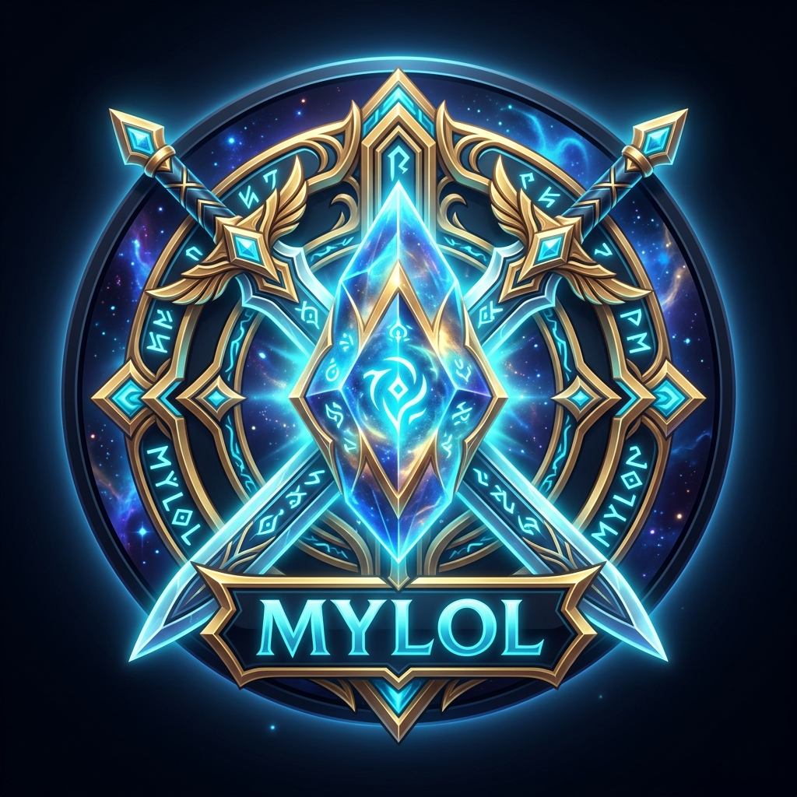

# ⚔️ MyLoL – League of Legends Alt-Account Manager & Desktop Client

<p align="center">
  
</p>

<p align="center">
  <b>A sleek, modern desktop client and dashboard to track, organize, and sync your League of Legends alternate and smurf accounts using the Riot Games API.</b>
</p>

<p align="center">
  
  
  
  
  
  
</p>

---

## 🌟 Key Features

* 🔄 **Real-Time Riot API Synchronization:** Live lookup and sync for Summoner Level, Solo/Duo & Flex ranks, LP, and recent match history via modern Riot ID (`GameName#TAG`).
* 🛡️ **Riot Games ToS & API Policy Compliant:** Purpose-built for personal account management without violating developer guidelines.
* ⚡ **Smart Rate-Limit Protection:** Built-in sequential batch delay loop (1500ms between accounts) and HTTP 429 backoff handling to prevent rate-limit exceedances.
* 🖥️ **Native Desktop Client Experience:**
  * Frameless dark Hextech theme with custom window drag region (`drag-region`).
  * Native window controls integrated directly into the titlebar.
  * Disables standard browser context menus and accidental refresh shortcuts (F5 / Ctrl+R).
  * Custom subtle dark scrollbars.
* 📊 **Interactive Analytics & Tag Filtering:** One-click filtering by account status (`Available`, `Active`, `Leveling`, `Archived`, `Banned`), tier badges, and live search.
* 🔒 **Secure & Local-First:** All API keys remain strictly on the server (`'use server'`), and all account data is stored locally in your MongoDB database.

---

## 🚀 Getting Started

### Prerequisites
* [Node.js](https://nodejs.org/) (v20 or higher recommended)
* [Yarn](https://yarnpkg.com/) package manager
* Local [MongoDB Community Server](https://www.mongodb.com/try/download/community) instance or a MongoDB Atlas URI
* A valid API Key from the [Riot Games Developer Portal](https://developer.riotgames.com/)

### 1. Clone the Repository
```bash
git clone https://github.com/ArtoMoon/lolstock.git
cd lolstock
```

### 2. Install Dependencies
```bash
yarn install
```

### 3. Configure Environment Variables
Create a `.env.local` file in the root directory:
```env
MONGODB_URI=mongodb://localhost:27017/
RIOT_API_KEY=RGAPI-your-riot-api-key-here
```

---

## 💻 Running the Application

### Web Development Mode (Browser)
```bash
yarn dev
```
Open [http://localhost:3000](http://localhost:3000) in your web browser.

### Desktop Client Mode (Electron + Next.js)
```bash
yarn electron:dev
```
Launches the Next.js backend server and native Electron window simultaneously.

### Building Windows Executable (.exe)
```bash
# Builds unpacked standalone desktop application:
yarn electron:build:dir

# Builds single-file portable .exe:
yarn electron:build:portable
```
The compiled binaries will be output to `dist/win-unpacked/MyLoL.exe` or `dist/MyLoL-Portable-0.1.0.exe`.

---

## 📁 Project Architecture

```text
├── app/
│   ├── actions/          # Server Actions (syncAccounts.ts, accounts.ts)
│   ├── api/              # API Route Handlers (/api/sync-accounts, /api/accounts)
│   ├── accounts/[id]/    # Detailed match history & account analytics view
│   ├── layout.tsx        # Root layout, fonts & providers
│   └── page.tsx          # Main dashboard view
├── components/           # UI Components (AccountTable, StatusBadge, RankBadge, etc.)
├── electron/             # Electron main process & preload context bridge
├── lib/
│   ├── db/               # Global Mongoose cached connection
│   └── riot/             # Modular Riot API client (account, summoner, rank, matches)
├── models/               # MongoDB Mongoose schemas (Account.ts)
├── scripts/              # Standalone preparation & symlink dereferencing
└── package.json
```

---

## ⚖️ Legal Disclaimer

*MyLoL isn’t endorsed by Riot Games and doesn’t reflect the views or opinions of Riot Games or anyone officially involved in producing or managing League of Legends. League of Legends and Riot Games are trademarks or registered trademarks of Riot Games, Inc. League of Legends © Riot Games, Inc.*

---

## 📝 License

This project is licensed under the [MIT License](LICENSE).
